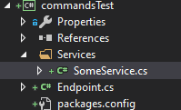
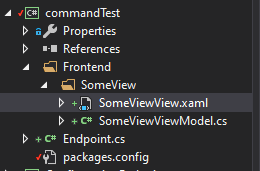

# How to use Powershell commands

There are some commands to create and handle endpoints much easier than before.   
When these commands are executed, they will automatically add templates(c#) files to your project.
You can add your business logic within these template files.
In this way the functionality is added to your dll after building your project.


## Available commands
- Add-PCTEndpoint - creates an endpoint template and adds all required packages and references to it.

- Add-PCTService - adds a new service to your project. You can code in this part to handle the endpoint communications. 

- Add-PCTHmiendpoint - creates an endpoint template with HMI commands support and adds all required packages and references to it.

- Add-PCTView - adds a visual interface to your already added HMI endpoint. 

- Add-PCTConfigEndpoint - creates a configuration endpoint template and adds all required packages and references.

- Add-PCTWebHost - creates a web host endpoint template and adds all required packages and references.

## Preparation steps

There are necessary steps to be done before using SDK.Commands:

1. Create an empty class library project
2. Install SDK.Commands.tools to project using nuget packages
3. Open ‘Package Manager Console’ (commands are available only there)

# Commands description
## Add-PCTEndpoint [Name] 

The Add-PCTEndpoint command will add to your project new file 'Endpoint.cs' which contains a basic implementation of 
endpoint class. The command will install all necessary nuget packages and provide logs of installation. It's strongly 
recommended to define only one endpoint per assembly. This command should be used only once per project.

Example:

```
PM> Add-PCTEndpoint MyEndpoint
... (nuget packages installation logs )
Time Elapsed: 00:00:00.5192937
Endpoint class has been successfully added
PM> 
```

## Add-PCTService [Name]

The Add-PCTService can be used to add service to existing endpoint. The services represent business logic that can be 
implemented and used by the endpoint. This command can be used multiple times in order to create multiple services.

Example:

```
PM> Add-PCTService MyService
... (nuget packages installation logs )
The service MyService has been successfully added to the project MyEndpoint
PM> 
```

Result project structure:   
    


## Add-PCTHmiendpoint [Name]

This command should be used for creating endpoint that is able to handle commands from ProconTel user interface view. 
The command doesn't create any view class, it only contains a specific implementation in case of handling commands that
can be called from endpoint status control. If you want to add a view to existing endpoint please use Add-PCTView command. 
After call this command 'Endpoint.cs' file will be created. It's strongly recommended to define only one endpoint per 
assembly. This command should be used only once per project.

Example:

```
PM> Add-PCTHmiendpoint MyHMIEndpoint
... (nuget packages installation logs )
Time Elapsed: 00:00:00.5192937
Endpoint class has been successfully added
PM> 
```

## Add-PCTView [Name] 

The Add-PCTView command will add to existing endpoint WPF view class with basic implementation. 

The command can be used only after Add-PCTHmiendpoint command.

Example:
```
PM> Add-PCTView SomeView
... (nuget packages installation logs )
Time Elapsed: 00:00:00.4659528
The service MyView has been successfully added to the project MyHMIEndpoint
PM>    
```

Result project structure:   
    

## Add-PCTConfigEndpoint [Name] 

The Add-PCTConfigEndpoint command will add to your project new file 'Endpoint.cs' which contains basic implementation of 
configuration endpoint class. The command will install all necessary nuget packages and provide logs of installation. It's strongly 
recommended to define only one endpoint per assembly. This command should be used only once per project.

Example:

```
PM> Add-PCTConfigEndpoint MyEndpoint
... (nuget packages installation logs )
Time Elapsed: 00:00:00.5192937
Endpoint class has been successfully added
PM> 
```
## Add-PCTWebHost [Name] [Url]

The Add-PCTWebHost command will add to your project new file 'Endpoint.cs' which contains basic implementation of 
web host endpoint class. The command will install all necessary nuget packages and provide logs of installation. It's strongly 
recommended to define only one endpoint per assembly. This command should be used only once per project.

Example:

```
PM> Add-PCTWebHost WebHost http://localhost:6000
... (nuget packages installation logs )
Time Elapsed: 00:00:00.5192937
Endpoint class has been successfully added
PM> 
```

> If you need more information about Endpoints in general, click here : [Creating an Endpoint](https://macrix.atlassian.net/wiki/spaces/PROC/pages/1762820188/How+to+author+a+custom+endpoint)

